# Entity Relationship Diagram (ERD) & Database Schema v5.0
**Project Name:** Synapse
**Database Engine:** MySQL 8.4 (InnoDB)
**Character Set / Collation:** utf8mb4 / utf8mb4_unicode_ci
**Sinkronisasi skema:** penuh dengan `database.sql` — closure plan/89–92
(3-Tier Rebate Engine & Promoter Program, 100% runtime-verified, `dec-94563cfd1af2c22e`).

---

## 0. ER Diagram (Mermaid)

Diagram di bawah mencakup **13 tabel kanonik** + relasi aktifnya (FK sesuai
`database.sql`). Tabel retention-only `rentals` & `otp_logs` (DEPRECATED M10)
dan `transactions` (decommissioned M6) **tidak** dirender — lihat §2, §4, §3.

```mermaid
erDiagram
    users {
        BIGINT id PK
        VARCHAR20 phone UK "login, dinormalkan 0XXXXXXXXXX"
        VARCHAR255 password "bcrypt"
        VARCHAR10 invite_code UK
        BIGINT parent_id FK "upline, NULL utk root"
        DECIMAL15-2 balance "DEFAULT 0.00"
        VARCHAR255 avatar_url
        INT level_id "0 = member biasa"
        TINYINT1 is_banned "0 = aktif"
        TINYINT1 is_promoter "plan/91, DEFAULT 0, admin-only"
        TINYINT1 must_change_password
        TINYINT1 is_level_1_claimed
        DATETIME last_wage_claimed_at
        TIMESTAMP created_at
        TIMESTAMP updated_at
    }
    gpu_products {
        INT id PK
        VARCHAR100 name
        ENUM type "short_term | long_term"
        DECIMAL15-2 price "integer IDR"
        DECIMAL15-2 daily_rate
        INT duration_days
        TINYINT1 is_refundable
        INT max_per_user "0 = tanpa batas (plan/83)"
        INT unlock_prerequisite_id "DORMANT plan/87, semua NULL"
        TINYINT1 is_active "satu-satunya gate ketersediaan"
        TIMESTAMP created_at
        TIMESTAMP updated_at
    }
    user_rentals {
        BIGINT id PK
        BIGINT user_id FK
        INT product_id FK
        ENUM source "purchase | promoter_reward (plan/91 K4)"
        DECIMAL15-2 purchase_price "0 utk kontrak reward (K7)"
        DECIMAL15-2 daily_roi
        INT total_days
        INT days_processed
        ENUM status "active | completed | cancelled"
        TIMESTAMP expired_at
        TIMESTAMP last_claimed_at
        TIMESTAMP created_at
    }
    promoter_claims {
        BIGINT id PK
        BIGINT user_id FK "promotor pemohon"
        INT product_id FK "produk reward"
        INT omzet_cost "omzet L1 dibakar, integer IDR"
        ENUM status "pending | approved | rejected"
        INT admin_id FK "approve/reject, NULL saat pending"
        VARCHAR255 admin_notes "wajib saat reject"
        TIMESTAMP created_at
        TIMESTAMP updated_at
    }
    bank_accounts {
        BIGINT id PK
        BIGINT user_id FK
        VARCHAR100 bank_name
        VARCHAR50 account_number
        VARCHAR100 account_holder
        TINYINT1 is_primary "DEFAULT 1"
        TIMESTAMP created_at
        TIMESTAMP updated_at
    }
    withdrawals {
        BIGINT id PK
        BIGINT user_id FK
        BIGINT bank_account_id FK
        VARCHAR50 wd_number UK "nullable"
        DECIMAL15-2 amount
        DECIMAL15-2 gross_amount
        DECIMAL15-2 fee_amount
        DECIMAL15-2 net_amount
        ENUM status "pending | processing | success | failed"
        VARCHAR255 remark
        VARCHAR255 decline_reason
        TIMESTAMP processed_at
        TIMESTAMP created_at
        TIMESTAMP updated_at
    }
    wallet_ledger {
        BIGINT id PK
        BIGINT user_id FK
        VARCHAR50 transaction_id
        ENUM type "credit | debit"
        DECIMAL15-2 amount "integer IDR (M8)"
        VARCHAR255 description
        TIMESTAMP created_at
    }
    deposits {
        BIGINT id PK
        BIGINT user_id FK
        VARCHAR50 invoice_number UK
        DECIMAL15-2 amount
        ENUM status "pending | success | failed"
        TIMESTAMP created_at
        TIMESTAMP updated_at
    }
    admins {
        INT id PK
        VARCHAR50 username UK
        VARCHAR255 password
        TIMESTAMP created_at
        TIMESTAMP updated_at
    }
    user_notifications {
        BIGINT id PK
        BIGINT user_id FK
        VARCHAR100 title
        TEXT message
        ENUM type "info | warning | success | commission"
        TINYINT1 is_read
        TIMESTAMP created_at
    }
    system_settings {
        INT id PK
        VARCHAR50 key_name UK
        TEXT key_value
        TIMESTAMP updated_at
    }
    system_audit_logs {
        BIGINT id PK
        INT admin_id FK "nullable"
        BIGINT user_id FK "nullable"
        VARCHAR100 action
        TEXT details "JSON/human-readable"
        VARCHAR45 ip_address
        TIMESTAMP created_at
    }
    rate_limits {
        BIGINT id PK
        VARCHAR191 rate_key UK
        INT attempts
        DATETIME last_attempt_at
        DATETIME locked_until "nullable"
    }

    users ||--o{ users : "parent_id (upline)"
    users ||--o{ bank_accounts : "memiliki"
    users ||--o{ deposits : "membuat"
    users ||--o{ wallet_ledger : "pemilik saldo"
    users ||--o{ withdrawals : "menarik"
    users ||--o{ user_rentals : "menyewa"
    users ||--o{ user_notifications : "menerima"
    users ||--o{ promoter_claims : "memohon reward"
    gpu_products ||--o{ user_rentals : "produk disewa"
    gpu_products ||--o{ promoter_claims : "produk reward"
    bank_accounts ||--o{ withdrawals : "rekening tujuan"
    admins ||--o{ promoter_claims : "approve/reject"
    admins ||--o{ system_audit_logs : "pelaku aksi"
    users ||--o{ system_audit_logs : "subjek aksi"
```

---

## 1. Important Rules for AI Agent (Hermes)
* **Storage Engine:** Semua tabel WAJIB menggunakan `InnoDB` untuk memastikan dukungan terhadap *ACID compliance* dan *Foreign Key constraints*.
* **Timestamps:** Setiap tabel wajib memiliki kolom `created_at` dan `updated_at` (Tipe: `TIMESTAMP`, Default: `CURRENT_TIMESTAMP` / `CURRENT_TIMESTAMP ON UPDATE CURRENT_TIMESTAMP`).
* **Soft Deletes:** Jangan gunakan penghapusan fisik pada data finansial dan riwayat sewa. Gunakan status (misal: `is_active = 0`) atau buat kolom `deleted_at`.
* **Foreign Key Constraints:** Data krusial seperti transaksi dan penarikan WAJIB menggunakan `ON DELETE RESTRICT` terhadap tabel `users` agar data tidak hilang jika user dihapus.
* **Database Transactions (ACID Compliance):** Semua mutasi finansial — termasuk tetapi tidak terbatas pada Insert ke `wallet_ledger`, Update ke `users.balance`, Insert ke `user_rentals`, Update ke `deposits.status` — WAJIB dibungkus dalam blok `$this->db->trans_start()` dan `$this->db->trans_complete()` (atau `trans_begin()` / `trans_commit()` / `trans_rollback()`). Kegagalan pada salah satu langkah dalam transaksi HARUS memicu rollback penuh untuk menjaga integritas data.
* **Sumber Kebenaran Skema:** `database.sql` adalah DDL kanonik (fresh-install sinkron). Setiap perubahan skema WAJIB diduplikasi ke `database.sql` + dokumen ini + ALTER idempotent untuk DB aktif (pola plan/90 §3 & plan/92 §4).
* **Integer IDR (M8):** MySQL memakai `DECIMAL(15,2)` demi kompatibilitas non-breaking, tetapi saldo otoritatif & seluruh aritmetika uang di aplikasi adalah **integer** (`(int)` choke-point; `intdiv()` untuk fee/persen). Kolom `omzet_cost`, `max_per_user`, dll. yang memang integer didefinisikan `INT UNSIGNED`.

---

## 2. Core Tables Specification

### Tabel: `users`
Menyimpan data autentikasi, profil pengguna, saldo utama, dan struktur *Adjacency List* untuk hierarki MLM/Keagenan.
* `id` (BIGINT, Primary Key, Auto Increment, Unsigned)
* `phone` (VARCHAR 20, UNIQUE, NOT NULL) - Nomor telepon login. **Normasi backend: `+62` → `0`, strip simbol (`-`, `()`, `spasi`) sebelum insert. Format final: `0XXXXXXXXXX`.**
* `password` (VARCHAR 255, NOT NULL) - Hashed Bcrypt.
* `invite_code` (VARCHAR 10, UNIQUE, NOT NULL) - Kode referral unik milik user ini (digenerate sistem saat register).
* `parent_id` (BIGINT, Unsigned, NULLABLE) - ID dari user Upline. **[Foreign Key -> users.id, ON DELETE SET NULL]**
* `balance` (DECIMAL 15,2, NOT NULL, DEFAULT 0.00) - Saldo dompet yang bisa ditarik/digunakan.
* `avatar_url` (VARCHAR 255, NULLABLE) - Path/URL foto profil.
* `level_id` (INT, NOT NULL, DEFAULT 0) - Menyimpan level keagenan saat ini (0 = Member biasa, 1 = Level 1, dst).
* `is_banned` (TINYINT 1, NOT NULL, DEFAULT 0) - 1 = akun dibanned (login/aksi diblokir, lockout).
* `is_promoter` (TINYINT 1, NOT NULL, DEFAULT 0) - **plan/91 (K1):** flag promotor, **hanya** diubah lewat toggle admin yang diaudit (`admin_toggle_promoter`). **Invariant gating-bypass:** `is_promoter = 1` mem-bypass gating referral **Condition A** ("wajib ≥ 1 rental seumur hidup") sehingga kode/link/QR referral tampil meski `lifetime == 0`; pembacaan flag SELALU segar di dalam TX (bukan session), jadi demosi langsung memblokir submit klaim baru (klaim pending tetap diproses — `dec-6d14b1039ad8cc30`).
* `must_change_password` (TINYINT 1, NOT NULL, DEFAULT 0) - 1 = paksa ganti sandi saat login berikutnya.
* `is_level_1_claimed` (TINYINT 1, NOT NULL, DEFAULT 0) - Idempotensi bonus Level 1 (Rp 80.000 sekali).
* `last_wage_claimed_at` (DATETIME, NULLABLE) - Stamp klaim wage mingguan (anti double-claim).
* `created_at` (TIMESTAMP, DEFAULT CURRENT_TIMESTAMP)
* `updated_at` (TIMESTAMP, DEFAULT CURRENT_TIMESTAMP ON UPDATE CURRENT_TIMESTAMP)
**Index Optimization:** `UNIQUE (phone)` = `uk_phone`, `UNIQUE (invite_code)` = `uk_invite_code`, `INDEX (parent_id)` = `idx_parent_id`, `INDEX (invite_code)` = `idx_invite_code`.
**Foreign Keys:** `fk_users_parent` → `users.id` ON DELETE SET NULL (self-referencing adjacency list).

### Tabel: `gpu_products`
Katalog paket GPUaaS (Marketplace). Data master; **tidak boleh** hard-delete (soft via `is_active`). 8 paket kanonik id 1–8 di-seed dari `database.sql` (Rp 150.000–Rp 10.000.000).
* `id` (INT, Primary Key, Auto Increment, Unsigned)
* `name` (VARCHAR 100, NOT NULL) - Contoh: "RTX 3060 Starter".
* `image` (VARCHAR 255, NULLABLE) - **plan/104:** nama berkas gambar produk (**BASENAME saja**, tanpa path) di `uploads/products/`. `NULL` **atau** berkas hilang di disk → marketplace merender fallback banner gelap (kontrak tunggal `product_image_url() === null`, helper `product_image_helper.php`). Berkas fisik bersifat runtime (`uploads/products/*` di-gitignore, placeholder `index.html` di-track) dan diunggah admin lewat `Admin::_handle_product_image_upload()` (allowlist `jpg|jpeg|png|webp`, maks 2048 KB, `detect_mime` + `encrypt_name`; SVG/executable ditolak). Backfill 8 paket kanonik dijalankan `scripts/migrate_104_gpu_product_images.php` — **keyed by `name`, bukan `id`** (id live bisa 5–12 sementara seed kanonik memakai 1–8).
* `type` (ENUM('short_term', 'long_term'), NOT NULL)
* `price` (DECIMAL 15,2, NOT NULL) - Harga untuk mulai menyewa (IDR).
* `daily_rate` (DECIMAL 15,2, NOT NULL) - Fix ROI (pendapatan harian) (IDR).
* `duration_days` (INT, NOT NULL, Unsigned) - Lama kontrak (misal: 25, 60).
* `is_refundable` (TINYINT 1, NOT NULL, DEFAULT 0) - 1 Jika harga `price` dikembalikan di akhir periode, 0 jika tidak.
* `max_per_user` (INT UNSIGNED, NOT NULL, DEFAULT 0) - **plan/83:** batas pembelian (kontrak) seumur hidup per user. `0` = tanpa batas; `N >= 1` = kuota lifetime. Satu-satunya gate pembelian per-user (GATE 2) — dihitung source-aware (lihat `user_rentals.source`, K4).
* `unlock_prerequisite_id` (INT UNSIGNED, NULLABLE) - **DEPRECATED (plan/87):** rantai prasyarat progresif DICOMMISSIONED; kolom/index/FK dipertahankan non-destruktif (semua baris `NULL`), **tidak ada kode yang membaca/menulis**. Ketersediaan produk 100% via `is_active`.
* `is_active` (TINYINT 1, NOT NULL, DEFAULT 1) - 1 = dijual di marketplace (toggle admin; satu-satunya gate ketersediaan).
* `created_at` (TIMESTAMP)
* `updated_at` (TIMESTAMP)
**Index/FK:** `INDEX (unlock_prerequisite_id)` = `idx_unlock_prerequisite`; `fk_gpu_products_unlock_prereq` → `gpu_products.id` ON DELETE RESTRICT (dormant).

### Tabel: `user_rentals`  ← tabel LIVE (pengganti `rentals`)
Menyimpan kontrak sewa GPU aktif/kedaluwarsa + kontrak reward promotor.
* `id` (BIGINT, Primary Key, Auto Increment, Unsigned)
* `user_id` (BIGINT, Unsigned, NOT NULL) - **[Foreign Key -> users.id, ON DELETE RESTRICT]**
* `product_id` (INT, Unsigned, NOT NULL) - **[Foreign Key -> gpu_products.id, ON DELETE RESTRICT]** (nama kolom = `product_id`, bukan `gpu_product_id`).
* `source` (ENUM('purchase','promoter_reward'), NOT NULL, DEFAULT 'purchase') - **plan/91 (K4):** asal kontrak. `purchase` = checkout/inject berbayar (default); `promoter_reward` = reward zero-cost hasil approve klaim promotor. **Invariant K4 (kuota independen per kanal):** baris `promoter_reward` TIDAK memakan kuota pembelian berbayar — semua COUNT kuota (GATE 2 `checkout_rental` & kuota marketplace `Product_model`) memfilter `source <> 'promoter_reward'`; kuota kanal reward dihitung terpisah (`source = 'promoter_reward'`) di gate submit/approve `Promoter_model`.
* `purchase_price` (DECIMAL 15,2, NOT NULL) - Harga beli snapshot. **K7:** kontrak reward selalu `0` → tidak memicu `_distribute_rebate` dan tidak menambah omzet upline.
* `daily_roi` (DECIMAL 15,2, NOT NULL) - Snapshot `gpu_products.daily_rate` saat kontrak dibuat.
* `total_days` (INT UNSIGNED, NOT NULL, DEFAULT 0)
* `days_processed` (INT UNSIGNED, NOT NULL, DEFAULT 0) - Counter ROI harian yang sudah diklaim.
* `status` (ENUM('active', 'completed', 'cancelled'), NOT NULL, DEFAULT 'active')
* `expired_at` (TIMESTAMP, NULLABLE) - `started + total_days` (WIB); sweep lazy M3 memakai `expired_at > <PHP WIB>`.
* `last_claimed_at` (TIMESTAMP, NULLABLE) - Untuk manual ROI claim (T+1).
* `created_at` (TIMESTAMP, DEFAULT CURRENT_TIMESTAMP)
**Index Optimization:** `idx_user_status_expired` (user_id, status, expired_at) — lazy sweep per-user + kualifikasi downline; `idx_status_expired` (status, expired_at) — sweep global/CLI/admin; `idx_product_id` (product_id).
**Foreign Keys:** `fk_user_rentals_user` → `users.id` RESTRICT; `fk_user_rentals_product` → `gpu_products.id` RESTRICT.
**Invariant K7 (kontrak zero-cost, plan/91):** kontrak reward = kontrak normal (aktif, ROI tetap via jalur klaim `ROI-{rental_id}-D…`) yang otomatis memenuhi syarat "≥ 1 kontrak aktif" untuk menerima komisi rebate 3-tier — efek yang diinginkan. Kontrak reward TIDAK memicu distribusi rebate saat diterbitkan (harga 0).

### Tabel: `rentals` — DEPRECATED (M10, plan/78)
Tabel legacy — **tidak ada jalur kode yang membaca/menulis**; tabel live = `user_rentals` (lihat §7 mapping). Retention-only untuk data historis; jangan dipakai di kode baru. Kolom: `id`, `user_id` (FK → users RESTRICT), `gpu_product_id` (FK → gpu_products RESTRICT), `status`, `total_days`, `days_processed`, `daily_rate_snapshot`, `started_at`, `ends_at`, `last_claimed_at`, `created_at`, `updated_at`.

---

## 3. Financial & Ledger Tables

### Tabel: `deposits`
Tabel staging untuk deposit yang diajukan oleh user. Record bersifat temporary — status berubah dari `pending` ke `success`/`failed` setelah proses approval.

* `id` (BIGINT, Primary Key, Auto Increment, Unsigned)
* `user_id` (BIGINT, Unsigned, NOT NULL) - **[Foreign Key -> users.id, ON DELETE RESTRICT]**
* `invoice_number` (VARCHAR 50, UNIQUE, NOT NULL) - Nomor invoice unik berformat `INV-{YmdHis}-{user_id}`.
* `amount` (DECIMAL 15,2, NOT NULL) - Nominal deposit dalam IDR.
* `status` (ENUM('pending', 'success', 'failed'), NOT NULL, DEFAULT 'pending') - Status pemrosesan deposit.
* `created_at` (TIMESTAMP, DEFAULT CURRENT_TIMESTAMP)
* `updated_at` (TIMESTAMP, DEFAULT CURRENT_TIMESTAMP ON UPDATE CURRENT_TIMESTAMP)

**Index Optimization:** `INDEX (user_id, status)` untuk query pending deposits per user.

> **Lifecycle:** User creates a deposit → status `pending` → displayed in "Menunggu Pembayaran" section → approved (simulator or gateway) → status `success` → credit entry minted into `wallet_ledger`.

### Tabel: `wallet_ledger`
Immutable, append-only ledger yang mencatat setiap pergerakan dana masuk (credit) dan keluar (debit). Saldo user dihitung secara dinamis dari tabel ini. **`wallet_ledger` adalah SATU-SATUNYA ledger transaksi yang otoritatif** — tabel `transactions` (double-entry) legacy telah didecommission pada M6 (lihat `plan/68` & `plan/69`); jangan membuat ulang atau menulis ke tabel tersebut.

* `id` (BIGINT, Primary Key, Auto Increment, Unsigned)
* `user_id` (BIGINT, Unsigned, NOT NULL) - **[Foreign Key -> users.id, ON DELETE RESTRICT]**
* `transaction_id` (VARCHAR 50, NOT NULL) - Referensi ke sumber transaksi (contoh: invoice number deposit, `RBT-{id}-L{tier}` rebate, `ROI-{rental_id}-D…`).
* `type` (ENUM('credit', 'debit'), NOT NULL) - `credit` = dana masuk, `debit` = dana keluar.
* `amount` (DECIMAL 15,2, NOT NULL) - Selalu positif. Arah ditentukan oleh kolom `type`.
* `description` (VARCHAR 255, NOT NULL) - Keterangan transaksi (contoh: "Top Up via INV-20260620123456-1").
* `created_at` (TIMESTAMP, DEFAULT CURRENT_TIMESTAMP)

**Index/Uniqueness:** `UNIQUE (user_id, transaction_id, type)` = `uk_wallet_ledger_user_tx_type` (idempotensi/anti-duplikasi); `INDEX (user_id)`, `INDEX (type)`, `INDEX (created_at)`.

> **Balance Calculation:** `SELECT SUM(CASE WHEN type = 'credit' THEN amount ELSE 0 END) - SUM(CASE WHEN type = 'debit' THEN amount ELSE 0 END) AS balance FROM wallet_ledger WHERE user_id = ?`

> **ACID Rule:** Every write to `wallet_ledger` MUST be wrapped in `$this->db->trans_start()` / `$this->db->trans_complete()`. A failed ledger insert MUST rollback all preceding operations in the same transaction (deposit status update, user balance adjustment, etc.).

> **Z1 / C4 (plan/89–92):** omzet-burn promotor (`promoter_claims`) dan penerbitan kontrak reward **tidak pernah** menyentuh `wallet_ledger` (burn = bookkeeping; reward `purchase_price = 0`). Semua kredit rebate lewat satu-satunya jalur `Wallet_model::credit()`.

### ~~Tabel: `transactions`~~ — DECOMMISSIONED (M6)
Tabel double-entry ledger lama. **TIDAK ADA LAGI** — telah dihapus pada M6 pragmatic path (audit: `plan/68_M6_TRANSACTIONS_TABLE_AUDIT_REPORT.md`; eksekusi: `plan/69_M6_DECOMMISSION_TRANSACTIONS_SUMMARY.md`). Aplikasi tidak pernah membaca/menulis tabel ini; seluruh pencatatan finansial memakai `wallet_ledger` (single ledger). Jangan membuat ulang tabel ini.

### Tabel: `bank_accounts`
Data rekening yang di-bind oleh user untuk keperluan Withdrawal.
* `id` (BIGINT, Primary Key, Auto Increment, Unsigned)
* `user_id` (BIGINT, Unsigned, NOT NULL) - **[Foreign Key -> users.id, ON DELETE CASCADE]**
* `bank_name` (VARCHAR 100, NOT NULL)
* `account_number` (VARCHAR 50, NOT NULL)
* `account_holder` (VARCHAR 100, NOT NULL)
* `is_primary` (TINYINT 1, NOT NULL, DEFAULT 1)
* `created_at` (TIMESTAMP)
* `updated_at` (TIMESTAMP)

### Tabel: `withdrawals`
Menyimpan antrean dan riwayat penarikan dana ke rekening bank.
* `id` (BIGINT, Primary Key, Auto Increment, Unsigned)
* `user_id` (BIGINT, Unsigned, NOT NULL) - **[Foreign Key -> users.id, ON DELETE RESTRICT]**
* `bank_account_id` (BIGINT, Unsigned, NOT NULL) - **[Foreign Key -> bank_accounts.id, ON DELETE RESTRICT]**
* `wd_number` (VARCHAR 50, UNIQUE, NULLABLE) - Nomor unik withdrawal (diisi saat diproses).
* `amount` (DECIMAL 15,2, NOT NULL, DEFAULT 0.00)
* `gross_amount` (DECIMAL 15,2, NOT NULL) - Total saldo user yang dipotong (Misal: 50,000).
* `fee_amount` (DECIMAL 15,2, NOT NULL) - Biaya layanan yang ditahan sistem (Misal: 6,500).
* `net_amount` (DECIMAL 15,2, NOT NULL) - Uang riil yang harus ditransfer admin ke user (Misal: 43,500).
* `status` (ENUM('pending', 'processing', 'success', 'failed'), NOT NULL, DEFAULT 'pending')
* `remark` (VARCHAR 255, NULLABLE) - Alasan jika penarikan di-reject/gagal.
* `decline_reason` (VARCHAR 255, NULLABLE) - Alasan reject terstruktur.
* `processed_at` (TIMESTAMP, NULLABLE) - Waktu ketika admin mengklik "Approve/Transfer".
* `created_at` (TIMESTAMP)
* `updated_at` (TIMESTAMP)

---

## 4. System, Settings & Security Tables

### Tabel: `otp_logs` — DEPRECATED (M10, plan/78)
Tabel legacy — **tidak ada flow OTP** (auth memakai native session CAPTCHA M8). Retention-only; jangan dipakai di kode baru. Kolom: `id`, `phone` (VARCHAR 20), `otp_code` (VARCHAR 6), `expires_at` (TIMESTAMP NOT NULL), `is_used` (TINYINT 1 DEFAULT 0), `created_at`. Tanpa FK.

### Tabel: `system_settings`
Key-value store konfigurasi runtime (circuit breaker + config finansial + rebate). Mutasi via jalur atomik `Admin_model::update_system_settings()` (audit `admin_update_settings`, before→after per key).
* `id` (INT UNSIGNED, Primary Key, Auto Increment)
* `key_name` (VARCHAR 50, NOT NULL, UNIQUE) - `uk_key_name`.
* `key_value` (TEXT, NOT NULL)
* `updated_at` (TIMESTAMP, DEFAULT CURRENT_TIMESTAMP ON UPDATE CURRENT_TIMESTAMP)

**Key ter-seed (idempotent `INSERT IGNORE` di `database.sql`):**

| Key | Default | Peran |
|---|---|---|
| `is_registration_open` | `1` | Circuit breaker registrasi (Phase 9A) |
| `wd_operational_days` / `wd_open_time` / `wd_close_time` | `1,2,3,4,5,6` / `07:00` / `19:00` | Window withdrawal (M1, plan/56) |
| `wd_fixed_fee` | `6500` | Biaya tetap withdrawal (M1) |
| `wd_fee_tiers` | JSON array tier | Tier fee withdrawal (M1) |
| `wd_min_amount` / `wd_max_amount` | `100000` / `50000000` | Batas nominal WD (M1) |
| `deposit_fee_enabled` / `deposit_fee_type` / `deposit_fee_value` | `0` / `flat` / `0` | Config fee deposit (M1) |
| `wa_number` / `support_email` | `628000000000` / `support@synapse.id` | Kontak/support (M7, plan/70) |
| **`rebate_enabled`** | `1` | **Plan 89:** master switch engine rebate 3-tier (0 = skip distribusi) |
| **`rebate_l1_percent`** | `5` | **Plan 89:** persen rebate L1 (integer 0–100) |
| **`rebate_l2_percent`** | `3` | **Plan 89:** persen rebate L2 |
| **`rebate_l3_percent`** | `1` | **Plan 89:** persen rebate L3 |

> Fallback kode: `application/config/rebate_commission.php` (1/5/3/1) dipakai bila baris belum ada. Admin mengubah via Card 5 di `admin/settings` (validasi 0–100 all-or-nothing + audit atomik).

### Tabel: `rate_limits`
Rate limiting & brute-force protection (Phase 10B). Satu baris per composite key (endpoint + identitas). Baris berumur pendek (GC ≤ 30 menit); **tanpa FK** (bukan data bisnis).
* `id` (BIGINT, Primary Key, Auto Increment, Unsigned)
* `rate_key` (VARCHAR 191, NOT NULL, UNIQUE) - `uk_rate_key`.
* `attempts` (INT UNSIGNED, NOT NULL, DEFAULT 0)
* `last_attempt_at` (DATETIME, NOT NULL)
* `locked_until` (DATETIME, NULLABLE)
**Index:** `idx_last_attempt_at` (last_attempt_at).

---

## 5. Notification & Engagement Table

### Tabel: `user_notifications`
Tabel notifikasi interaktif yang dipicu oleh AJAX polling. Menyimpan notifikasi sistem, reward, dan informasi akun.

* `id` (BIGINT, Primary Key, Auto Increment, Unsigned)
* `user_id` (BIGINT, Unsigned, NOT NULL) - **[Foreign Key -> users.id, ON DELETE CASCADE]** — Notifikasi dihapus otomatis jika user dihapus.
* `title` (VARCHAR 100, NOT NULL) - Judul singkat notifikasi (contoh: "Bonus Level 1 Terkirim!").
* `message` (TEXT, NOT NULL) - Isi detail notifikasi (contoh: "Selamat! Kamu telah mencapai Level 1 Agency...").
* `type` (ENUM('info', 'warning', 'success', 'commission'), NOT NULL) - Kategori notifikasi untuk styling badge warna:
    * `info` → slate badge
    * `warning` → amber badge
    * `success` → emerald badge
    * `commission` → emerald badge dengan ikon `fa-coins`
* `is_read` (TINYINT 1, NOT NULL, DEFAULT 0) - 0 = belum dibaca (tampil di Red Badge), 1 = sudah dibaca.
* `created_at` (TIMESTAMP, DEFAULT CURRENT_TIMESTAMP)

**Index Optimization:** `INDEX (user_id, is_read)` — Composite index untuk query unread count yang sangat sering: `SELECT COUNT(*) FROM user_notifications WHERE user_id = ? AND is_read = 0`.

> **Lifecycle:** Backend insert notifikasi → AJAX poll dari `header.php` fetches unread count → render Red Badge → user taps bell → fetch notification list → mark `is_read = 1` per item atau bulk "Mark All Read". Notifikasi approve/reject klaim promotor & toggle promotor ditulis **atomik dalam TX yang sama** dengan mutasinya (pola M5/N2, plan/91).

---

## 6. Admin, Agency & Promoter Tables

### Tabel: `admins`
Tabel terpisah untuk autentikasi admin/operator. Hard-separated dari `users` — tidak ada foreign key ke `users.id`.
* `id` (INT UNSIGNED, Primary Key, Auto Increment)
* `username` (VARCHAR 50, UNIQUE, NOT NULL) - Username login admin.
* `password` (VARCHAR 255, NOT NULL) - Hashed Bcrypt/Argon2id.
* `created_at` (TIMESTAMP, DEFAULT CURRENT_TIMESTAMP)
* `updated_at` (TIMESTAMP, DEFAULT CURRENT_TIMESTAMP ON UPDATE CURRENT_TIMESTAMP)

> **Security Note:** Tabel ini sepenuhnya terpisah dari `users`. Session admin menggunakan `admin_id` (bukan `user_id`). Tidak ada foreign key relasi ke tabel user — kecuali sebagai pelaku aksi di `system_audit_logs` dan approver di `promoter_claims`.

### Tabel: `promoter_claims`
**Plan/91 (Omzet Burn):** antrean klaim reward promotor — promotor membakar omzet L1 (`omzet_cost`) untuk mendapat kontrak reward zero-cost (K7). **Invariant Z1/C4:** submit/approve/reject TIDAK pernah menyentuh `wallet_ledger`; burn = bookkeeping di tabel ini.
* `id` (BIGINT, Primary Key, Auto Increment, Unsigned)
* `user_id` (BIGINT UNSIGNED, NOT NULL) - Promotor pemohon. **[Foreign Key -> users.id, ON DELETE RESTRICT]**
* `product_id` (INT UNSIGNED, NOT NULL) - Produk reward (harus ada di peta tier `promoter_rewards.php`). **[Foreign Key -> gpu_products.id, ON DELETE RESTRICT]**
* `omzet_cost` (INT UNSIGNED, NOT NULL) - Omzet L1 yang dibakar (integer IDR, M8; `^[1-9][0-9]*$`).
* `status` (ENUM('pending','approved','rejected'), NOT NULL, DEFAULT 'pending') - Flip kondisional `WHERE status='pending'` + gate `affected_rows()===1` (M4, anti double-action).
* `admin_id` (INT UNSIGNED, NULLABLE) - Admin yang approve/reject (NULL saat pending). **[Foreign Key -> admins.id, ON DELETE SET NULL]**
* `admin_notes` (VARCHAR 255, NULLABLE) - Catatan admin (WAJIB via UI saat reject; opsional saat approve).
* `created_at` (TIMESTAMP, DEFAULT CURRENT_TIMESTAMP)
* `updated_at` (TIMESTAMP, DEFAULT CURRENT_TIMESTAMP ON UPDATE CURRENT_TIMESTAMP)
**Index Optimization:** `idx_user_status` (user_id, status) — riwayat klaim per promotor; `idx_status_created` (status, created_at) — queue admin + pagination; `idx_product_id` (product_id).
**Foreign Keys:** `fk_promoter_claims_user` → `users.id` RESTRICT; `fk_promoter_claims_product` → `gpu_products.id` RESTRICT; `fk_promoter_claims_admin` → `admins.id` ON DELETE SET NULL.
**Invariant K5 (rasio CAC):** guard `8·cost ≤ 100·price ≤ 10·cost` (integer murni) dievaluasi saat submit & approve terhadap harga produk saat ini.
**Alur:** pending (submit promotor) → `approved` (kontrak zero-cost `user_rentals` `source='promoter_reward'` + notifikasi + audit `promoter_claim_approved`) | `rejected` (lock omzet lepas + `admin_notes` + notifikasi + audit `promoter_claim_rejected`). Tidak ada transisi pembatalan klaim; koreksi salah-approve via `cancel_rental` admin.

### Tabel: `system_audit_logs`
Trail audit untuk setiap aksi admin terhadap data finansial & konfigurasi.
* `id` (BIGINT, Primary Key, Auto Increment, Unsigned)
* `admin_id` (INT, NULLABLE) - **[Foreign Key → admins.id, ON DELETE SET NULL]**
* `user_id` (BIGINT, NULLABLE) - **[Foreign Key → users.id, ON DELETE SET NULL]**
* `action` (VARCHAR 100, NOT NULL) - Contoh: `approved_deposit`, `declined_withdrawal`, `admin_update_settings`, `admin_toggle_promoter`, `promoter_claim_approved`, `promoter_claim_rejected`.
* `details` (TEXT, NULLABLE) - JSON atau human-readable deskripsi (termasuk before→after per key).
* `ip_address` (VARCHAR 45, NOT NULL) - IPv4/IPv6 alamat pelaku aksi.
* `created_at` (TIMESTAMP, DEFAULT CURRENT_TIMESTAMP)
**Index Optimization:** `idx_admin_id`, `idx_user_id`, `idx_action`, `idx_created_at`.
> Mutasi finansial/konfigurasi/klaim ditulis **atomik dalam TX yang sama** dengan aksinya (M5/A1).

---

## 7. Schema Divergence & Architectural Invariants

### `user_rentals` vs `rentals` (Original ERD)
Tabel `rentals` dalam ERD v3.0 **tidak digunakan** dalam implementasi aktual dan telah ditandai **DEPRECATED (M10)**. Tabel live = **`user_rentals`**:

| Kolom ERD (`rentals`) | Kolom Aktual (`user_rentals`) |
|------------------------|-------------------------------|
| `gpu_product_id` | `product_id` |
| `total_days` | `total_days` (dihitung juga dari `expired_at`) |
| `days_processed` | `days_processed` |
| `daily_rate_snapshot` | `daily_roi` |
| `started_at` | *(DEFAULT CURRENT_TIMESTAMP)* |
| `ends_at` | `expired_at` |
| *(baru)* | `last_claimed_at` (untuk manual ROI claim) |
| *(baru)* | `purchase_price` |
| *(baru)* | `source` ENUM('purchase','promoter_reward') (plan/91 K4) |

Tabel `user_rentals` juga berfungsi sebagai tabel `rentals` di dalam kode (`application/models/Rental_model.php`).

### Inventory kanonik (13 tabel) vs retention-only
- **Kanonik (live):** `users`, `gpu_products`, `user_rentals`, `promoter_claims`, `deposits`, `withdrawals`, `bank_accounts`, `wallet_ledger`, `user_notifications`, `admins`, `system_settings`, `system_audit_logs`, `rate_limits`.
- **Retention-only (DEPRECATED M10):** `rentals` (live = `user_rentals`), `otp_logs` (tidak ada flow OTP).
- **Dihapus dari skema kanonik:** `site_settings` (M7 → `system_settings`), `transactions` double-entry (M6 → `wallet_ledger`).

### Invariant arsitektural yang diregistrasikan (plan/89–92)
- **K1 — `is_promoter` admin-only:** flag hanya berubah lewat toggle admin ber-audit (`admin_toggle_promoter` before→after + notifikasi info).
- **K4 — Kuota independen per kanal:** kanal paid (`source='purchase'`) dan kanal reward (`source='promoter_reward'`) punya kuota `max_per_user` terpisah; kontrak reward tidak memakan kuota pembelian berbayar.
- **K5 — Guard rasio CAC** 8–10% (integer) pada submit & approve klaim.
- **K6 — Demosi segar:** gate submit membaca `is_promoter` segar dalam TX; klaim pending tetap diproses.
- **K7 — Kontrak zero-cost:** `source='promoter_reward'`, `purchase_price = 0`, tanpa `_distribute_rebate`, tanpa dampak omzet upline; burn omzet TIDAK menyentuh `wallet_ledger` (Z1/C4).
